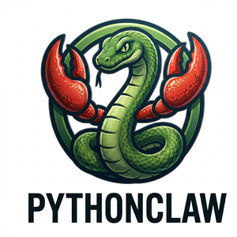

<p align="center">
  
</p>

<h1 align="center">value_claw</h1>

<p align="center">
  <strong>Your Autonomous AI Investment Analyst — Built in pure Python.</strong><br>
  Market Research · Fundamentals Analysis · Web Dashboard · Voice · Multi-Channel
</p>

<p align="center">
  <a href="https://github.com/ericwang915/ValueClaw/actions/workflows/ci.yml">
    
  </a>
  <a href="https://pypi.org/project/value_claw/">
    
  </a>
  
  <a href="LICENSE">
    
  </a>
  <a href="https://github.com/ericwang915/ValueClaw/stargazers">
    
  </a>
</p>

<p align="center">
  <em>An intelligent agent dedicated to deep financial research, SEC filing analysis, and market monitoring.</em>
</p>

---

## Highlights

| | Feature | Details |
|---|---------|---------|
| 📈 | **Investment Analysis** | Fundamental and technical research, generating actionable market insights |
| 🧠 | **Provider-agnostic** | DeepSeek, Grok, Claude, Gemini, Kimi, GLM — or any OpenAI-compatible API |
| 🛠️ | **Extensible Skills** | Add custom Python scripts or workflows for your own research pipelines |
| 💾 | **Persistent memory** | Markdown-based long-term memory with daily logs and semantic recall |
| 🔍 | **Hybrid RAG** | BM25 + dense embeddings + RRF fusion + LLM re-ranking |
| 🌐 | **Web dashboard** | Browser UI for chat, config, skill catalog, and identity editing |
| 🎙️ | **Voice input** | Deepgram speech-to-text in the web chat |
| ⏰ | **Cron schedules** | Schedule recurring market monitoring tasks (e.g. daily news brief at 9 AM) tracked via Prefect |
| 📡 | **Multi-channel** | CLI, Web, Telegram, Discord, WhatsApp — same analyst, different interfaces |
| 🔄 | **Daemon mode** | PID-managed background process with `start` / `stop` / `status` |

---

## Quick Start

```bash
pip install value_claw

# First-time setup — choose your LLM provider and enter API key
value_claw onboard

# Start the agent daemon (web dashboard at http://localhost:7788)
value_claw start

# Interactive CLI chat
value_claw chat

# Stop the daemon
value_claw stop
```

**From source:**

```bash
git clone https://github.com/ericwang915/ValueClaw.git
cd value_claw
pip install -e .
value_claw onboard
```

---

## CLI Reference

| Command | Description |
|---------|-------------|
| `value_claw onboard` | Interactive setup wizard — choose LLM provider, enter API key |
| `value_claw start` | Start the agent as a background daemon |
| `value_claw start -f` | Start in foreground (no daemonize) |
| `value_claw start --channels telegram discord whatsapp` | Start with messaging channels |
| `value_claw stop` | Stop the running daemon |
| `value_claw status` | Show daemon status (PID, uptime, port) |
| `value_claw chat` | Interactive CLI chat (foreground REPL) |

### First Run

```
$ value_claw start

  ╔══════════════════════════════════════╗
  ║       value_claw — Setup Wizard      ║
  ╚══════════════════════════════════════╝

  Choose your LLM provider:

    1. DeepSeek
    2. Grok (xAI)
    3. Claude (Anthropic)
    4. Gemini (Google)
    5. Kimi (Moonshot)
    6. GLM (Zhipu / ChatGLM)

  Enter number (1-6): 2
  → Grok (xAI)

  API Key: ********
  → Key set (xai-****)

  Validating... ✔ Valid!
  ✔ Setup complete!

[value_claw] Daemon started (PID 12345).
[value_claw] Dashboard: http://localhost:7788
```

---

## Architecture

```
┌──────────────────────────────────────────────────────────────┐
│                         value_claw                            │
├──────────┬────────────┬───────────┬──────────────────────────┤
│ CLI      │ Daemon     │ Sessions  │      Core                │
│          │            │           │                          │
│ onboard  │ start /    │ Store(MD) │ Agent                    │
│ chat     │ stop /     │ Manager   │ ├─ Memory (Markdown)     │
│ skill …  │ status     │ Locks +   │ ├─ RAG (Hybrid)          │
│          │            │ Semaphore │ ├─ Skills (3-tier)       │
│ Web UI ◄─┤ Channels   │           │ ├─ Compaction            │
│ Voice In │ Telegram   │ Per-group │ ├─ Soul + Persona        │
│          │ Discord    │ Isolation │ ├─ Group Context          │
│          │ WhatsApp   │           │ └─ Tool Execution        │
├──────────┴────────────┴───────────┴──────────────────────────┤
│               LLM Provider Abstraction Layer                 │
│ DeepSeek │ Grok │ Claude │ Gemini │ Kimi │ GLM              │
└──────────────────────────────────────────────────────────────┘
```

---

## Web Dashboard

Start with `value_claw start` and open **http://localhost:7788**.

- **Dashboard** — agent status, persona preview, active tools
- **Chat** — real-time chat with voice input (Deepgram)
- **Configuration** — edit LLM provider, API keys, and settings in-browser

---

## Configuration

All configuration lives in `value_claw.json` (auto-created by `value_claw onboard`).
See [`value_claw.example.json`](value_claw.example.json) for the full template.

```jsonc
{
  "llm": {
    "provider": "grok",
    "grok": { "apiKey": "xai-...", "model": "grok-3" }
  },
  "tavily":   { "apiKey": "" },
  "deepgram": { "apiKey": "" },
  "web":      { "host": "0.0.0.0", "port": 7788 },
  "channels": {
    "telegram": { "token": "" },
    "discord":  { "token": "" },
    "whatsapp": { "phoneNumberId": "", "token": "", "verifyToken": "value_claw_verify" }
  },
  "isolation":   { "perGroup": false },
  "concurrency": { "maxAgents": 4 }
}
```

Environment variables (e.g. `DEEPSEEK_API_KEY`, `TAVILY_API_KEY`) override JSON values.

---

## Supported LLM Providers

| Provider | Default Model | Install Extra |
|----------|---------------|---------------|
| **DeepSeek** | `deepseek-chat` | — |
| **Grok (xAI)** | `grok-3` | — |
| **Claude (Anthropic)** | `claude-sonnet-4-20250514` | — (included) |
| **Gemini (Google)** | `gemini-2.0-flash` | — (included) |
| **Kimi (Moonshot)** | `moonshot-v1-128k` | — |
| **GLM (Zhipu)** | `glm-4-flash` | — |
| Any OpenAI-compatible | Custom | — |

---

## Skills Pipeline

Expand your analyst's capabilities by writing custom tools. `value_claw` loads skills progressively:

| Level | Loaded When | Content |
|-------|-------------|---------|
| **L1 — Metadata** | Always (startup) | `name` + `description` from YAML frontmatter |
| **L2 — Instructions** | Agent activates skill | Full SKILL.md body |
| **L3 — Resources** | As needed | Bundled Python scripts, schemas, data files |

```yaml
---
name: sec_filings
description: Fetch and analyze 10-K and 10-Q reports from SEC EDGAR.
---
# SEC Filings Analyzer

## Instructions
Run `python {skill_path}/fetch_edgar.py "TICKER"`
```

---

## Memory & RAG

### Markdown Memory

```
~/.value_claw/context/memory/
├── MEMORY.md           # Curated long-term memory
└── 2026-03-24.md       # Daily append-only log
```

When **per-group isolation** is enabled (`"isolation": { "perGroup": true }` in config),
each session (Telegram chat, Discord channel, etc.) gets its own `memory/`, `persona/`,
and `soul/` under `~/.value_claw/context/groups/<session-id>/`, while global memories
remain accessible via read-through fallback.

### Hybrid RAG Pipeline

For deep research spanning multiple documents:
```
Query → BM25 (sparse) + Embeddings (dense) → RRF Fusion → LLM Re-ranker → Top-K
```

---

## Development

```bash
git clone https://github.com/ericwang915/ValueClaw.git
cd value_claw
python -m venv .venv && source .venv/bin/activate
pip install -e .
pytest tests/ -v
```

---

## License

[MIT](LICENSE)

---

<p align="center">
  <sub>If value_claw helps you navigate the markets, consider giving it a ⭐</sub>
</p>
